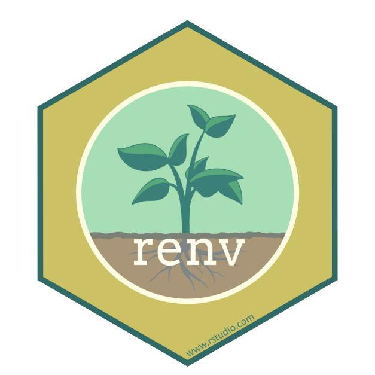
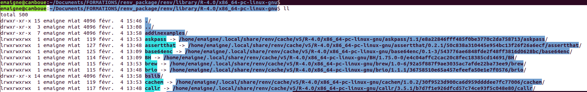
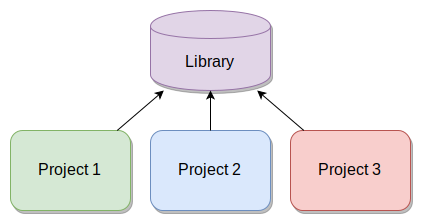

```{r setup, include=FALSE}
options(htmltools.dir.version = FALSE)
```

```{r xaringan-themer, include=FALSE, warning=FALSE}
library(xaringanthemer)
style_mono_light(
  base_color = "#363636",
  code_inline_color = "#107006",
  text_bold_color = "#822744",
  header_font_google = google_font("Yanone Kaffeesatz"),
  link_color = "#ff0f87"
)
```

class: center, middle

# renv c'est quoi ? 

---
### Package renv

- Un package R créé par Kevin Ushey

> "new effort to bring project-local R dependency management to your projects". 

--

- renv ~ packrat 2.0 (aussi par Kevin Ushey)

> "The goal is for renv to be a robust, stable replacement for the Packrat package, with fewer surprises and better default behaviors."

--

- Figer et/ou partager les versions des packages de R utilisés **pour un projet**.


--

.center[]
.center[]

---

# Initialisation

Dans un dossier spécifique (la racine d'un projet) :

```{r, eval=FALSE}
install.packages("renv")
library(renv)
renv::init()
```

**OU**

en mode projet Rstudio (.Rproj), sur un nouveau projet

File > New project > New directory > "Activate renv with this project". 

(aussi dans les options du projet, onglet **Environments**)


Et voilà !

---

# Fonctionnement

`renv::init()` crée : 

.pull-left[
- ###un fichier **.Rprofile**
- un fichier **renv.lock**
- un dossier **renv** contenant :
  - un fichier **.gitignore**
  - un fichier **activate.R**
  - un fichier **settings.dcf**
  - un dossier **stagging**
  - un dossier **library**
]

.pull-right[
active renv au démarrage du projet/lancement de R depuis ce dossier
]

---

# Fonctionnement

`renv::init()` crée : 

.pull-left[
- un fichier **.Rprofile**
- ###un fichier **renv.lock**
- un dossier **renv** contenant :
  - un fichier **.gitignore**
  - un fichier **activate.R**
  - un fichier **settings.dcf**
  - un dossier **stagging**
  - un dossier **library**
]

.pull-right[
</br></br>
stocke la version de R utilisée et les versions des dépendances **dont on a besoin dans le code**
]

---

# Fonctionnement

`renv::init()` crée : 

.pull-left[
- un fichier **.Rprofile**
- un fichier **renv.lock**
- un dossier **renv** contenant :
  - ###un fichier **.gitignore**
  - un fichier **activate.R**
  - un fichier **settings.dcf**
  - un dossier **stagging**
  - un dossier **library**
]

.pull-right[
</br></br></br></br>
Si on travaille aussi avec git, les gros fichiers ne seront pas commités (les packages)
]

---

# Fonctionnement

`renv::init()` crée : 

.pull-left[
- un fichier **.Rprofile**
- un fichier **renv.lock**
- un dossier **renv** contenant :
  - un fichier **.gitignore**
  - ###un fichier **activate.R**
  - ###un fichier **settings.dcf**
  - un dossier **stagging**
  - un dossier **library**
]

.pull-right[
</br></br></br></br></br>
Gère où il va chercher les packages, les différents repos, ...

</br>
Les paramètres du renv
]


---

# Fonctionnement

`renv::init()` crée : 

.pull-left[
- un fichier **.Rprofile**
- un fichier **renv.lock**
- un dossier **renv** contenant :
  - un fichier **.gitignore**
  - un fichier **activate.R**
  - un fichier **settings.dcf**
  - ###un dossier **stagging**
  - ###un dossier **library**
]

.pull-right[
</br></br></br></br></br></br></br>
Pour l'installation des "staged packages"

</br>
</br>
Pour l'installation des autres packages
]


---

# Fonctionnement

Ce qui nous concerne c'est la gestion des libraries. 

Quand on est dans un projet géré avec renv, on peut voir que le `.libPaths()` change : 

**Sans renv :**

```{r, eval = FALSE}
> .libPaths()
[1] "/home/emaigne/R/x86_64-pc-linux-gnu-library/4.0"
[2] "/opt/R/4.0.3/lib/R/library"
```

**Avec renv :**

```{r, eval = FALSE}
> .libPaths()
[1] "/home/emaigne/Documents/FORMATIONS/renv_package/renv/library/R-4.0/x86_64-pc-linux-gnu"
[2] "/tmp/RtmpHmJq4n/renv-system-library" 
```


---

# Fonctionnement

De ce qu'on voit les packages sont installés dans un sous dossier du dossier **library**.

--

Et bien non !!



Ce sont des liens symboliques vers un dossier de cache qui contient les différentes versions des packages. 

---

# Fonctionnement

.pull-left[
### Sans renv :
<figure>

<p style='font-size: 10px;'>&copy; Kevin Ushley, <a>https://kevinushey-2020-rstudio-conf.netlify.app/slides.html</a></p>

Une seule version par package.
]
.pull-right[
### Avec renv :

<p style='font-size: 10px;'>&copy; Kevin Ushley, <a>https://kevinushey-2020-rstudio-conf.netlify.app/slides.html</a></p>

Le cache permet d'avoir plusieurs verisons du même package.

Le cache peut être désactivé pour un projet &#9658; Les packages iront dans le `library` spécifique. 
]

---

# Commandes à connaitre

.pull-left[
- ####**`renv::init()`**
- `renv::snapshot()`
- `renv::status()`
- `renv::dependencies()`
- `renv::restore()`
]

.pull-right[

Pour initialiser l'utilisation de renv dans le projet.
]

---

# Commandes à connaitre

.pull-left[
- `renv::init()`
- ####**`renv::snapshot()`**
- `renv::status()`
- `renv::dependencies()`
- `renv::restore()`
]

.pull-right[
</br></br>
Pour sauver l'état des packages utilisés dans le fichier renv.lock
]

Exemple : 

```{r, eval = FALSE}
> renv::snapshot()
The following package(s) will be updated in the lockfile:
# CRAN ===============================
- BH               [* -> 1.75.0-0]
- R6               [* -> 2.5.0]
- Rcpp             [* -> 1.0.6]
- base64enc        [* -> 0.1-3]

Do you want to proceed? [y/N]: 
```


---

# Commandes à connaitre

.pull-left[
- `renv::init()`
- `renv::snapshot()`
- ####**`renv::status()`**
- `renv::dependencies()`
- `renv::restore()`
]

.pull-right[
Pour savoir où on en est par rapport au fichier renv.lock. 

Est-ce qu'il y a des packages non présents dans renv.lock ? 

Des packages dans renv.lock non utilisés dans le code R ? 
]

Exemple : 

Uniquement packages appelés dans les scripts R d'une des façons suivantes :
```{r, eval=FALSE}
renv::status()
The following package(s) are installed but not recorded in the lockfile:
  Rcpp             [1.0.6]
  whisker          [0.4]
  knitr            [1.31]
  
Use `renv::snapshot()` to add these packages to your lockfile.
```

---

# Commandes à connaitre

.pull-left[
- `renv::init()`
- `renv::snapshot()`
- `renv::status()`
- ####**`renv::dependencies()`**
- `renv::restore()`
]

.pull-right[
</br></br>
Quels sont les packages utilisés dans le code ? 

Uniquement packages appelés dans les scripts R (.R ou .Rmd ou .Rnw ou DESCRIPTION) d'une des façons suivantes :
```{r, eval=FALSE}
library(package)
require(package)
requireNamespace("package")
package::method()
```
]

---

# Commandes à connaitre

.pull-left[
- `renv::init()`
- `renv::snapshot()`
- `renv::status()`
- `renv::dependencies()`
- ####**`renv::restore()`**
]

.pull-right[
</br></br></br></br>
Pour revenir à l'état du renv.lock. i.e. désinstalle les packages en trop, réinstalle les packages manquants. 

(ça ne désinstalle pas vraiment, ça supprime l'entrée dans `library`)
]

---

# Commandes à connaitre

.pull-left[
- `renv::init()`
- `renv::snapshot()`
- `renv::status()`
- `renv::dependencies()`
- `renv::restore()`
]

.pull-right[

]

<hr>

Pour une utilisation plus fine du package, voir :

https://kevinushey-2020-rstudio-conf.netlify.app/slides.html

---

# Retour d'expérience - Changement de version de R

renv ne gère pas la version de R (bien que ce soit dans renv.lock). 

--

Sur un projet à plusieurs certains étaient en R3, d'autres en R4. En cours de route on a essayé d'uniformiser
.small[
1. tout le monde installe la version 4
2. utilisation de renv
]

--

La majorité des problèmes rencontrés venaient du fait du partage de libraries par défaut de R, une fois passé à la version 4.

les packages sont potentiellement déjà installés, mais compilés avec une mauvaise version de R &#9658; renv ne savait pas les installer, installation manuelle de tous les packages et dépendences. 

--

.center[]

---

# Retour d'expérience - Utilisation avec git

**renv prend tout son sens !!** On peut partager les memes versions de packages avec ses collaborateurs. 

--

#### Partage à minima :

- le fichier renv.lock

Une autre personne peut, chez elle faire un `renv::init()` pour installer les packages correspondants. 

--

####  Pour partager en cours de développement (**comportement par défaut en faisant un commit**) :

- le fichier renv.lock
- le fichier .Rprofile
- le dossier renv/ avec dedans:
    - .gitignore
    - settings.dcf
    - activate.R

En théorie renv s'active tout seul chez les autres membres du projet. 

Ils peuvent alors utiliser `renv::restore()` pour récupérer les bonnes versions des packages.


---

# Tips and tricks

- **renv** c'est bien, notamment pour partager/archiver ses codes.

- initialement je pensais que c'était lourd à gérer mais j'ai découvert l'existence du cache.

- au démarrage, R nous dit que renv est utilisé (ou pas) :

```{r, eval = FALSE}
Tapez 'demo()' pour des démonstrations, 'help()' pour l'aide
en ligne ou 'help.start()' pour obtenir l'aide au format HTML.
Tapez 'q()' pour quitter R.

* Project '~/Documents/FORMATIONS/2021_renv_package' loaded. [renv 0.12.3]
```

- `renv::status()` est très pratique, en abuser. 

---
class: center, middle

# des questions ?

